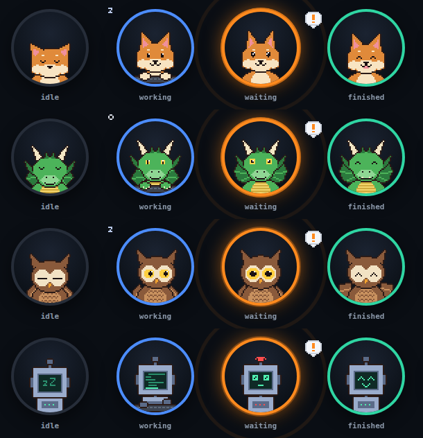

<p align="center"></p>

<h1 align="center">Deskling</h1>

<p align="center">A small pixel-art companion in the corner of your screen that shows what your Claude Code sessions are doing.</p>

<p align="center"><a href="https://apps.microsoft.com/detail/9nnsg351d4bq"><b>Get it from the Microsoft Store</b></a> · <a href="https://github.com/ozanberkpolat/deskling/releases/latest/download/deskling-setup.exe">Installer</a> · <a href="https://obp.com.tr/deskling">Website</a></p>

<p align="center"></p>

Start a long task in Claude Code, switch to something else, and stop checking the terminal. Deskling
sleeps while nothing happens, gets to work while a session works, and sits up and calls you (once)
when a session needs your answer or permission. You can allow or deny that permission right from its
list, or click the session to bring its terminal to the front. When a turn finishes it celebrates,
and the ring stays green until you have looked.

The ring around it tells you the state at a glance:

| Ring | Means |
| --- | --- |
| grey, faded | nothing running |
| blue | a session is working |
| orange, pulsing | a session waits for you (permission or a question) |
| green | a session finished since you last looked |
| red | a turn ended on an API error (rate limit included) |

## Install

Two ways to get the same app. Pick one, not both (they would share the hooks and port 8033).

- **[Microsoft Store](https://apps.microsoft.com/detail/9nnsg351d4bq)**, as *Deskling: Desk Buddy*
  (the plain name was taken there). Signed by Microsoft, so it installs with Smart App Control on,
  and it updates itself. Recommended.
- **Installer from GitHub:** [`deskling-setup.exe`](https://github.com/ozanberkpolat/deskling/releases/latest/download/deskling-setup.exe).
  No admin rights needed; it installs for your user only. It is not code-signed yet:
  - Windows SmartScreen asks once: **More info → Run anyway**.
  - **Smart App Control** (Windows 11) blocks unsigned installers outright, with no per-app
    exception. If it is on, use the Store version, or turn it off in Windows Security → App &
    browser control → Smart App Control.

On first start Deskling asks whether to watch Claude Code on this PC (see below). Say yes. Claude
Code sessions you start from then on show up; sessions that were already open usually pick the
change up too.

Windows 10 and 11. A macOS version is planned.

## Using it

- **Click** the box for the list of sessions: project, what it is doing, how long, and what it has
  cost so far (with the status line option below).
- **Allow / Deny:** when a session asks for permission, its row shows the command with Allow and
  Deny buttons. Claude Code's own prompt is in the terminal at the same time; whichever you answer
  first wins. If you answer neither within 90 s, nothing is decided for you: the terminal prompt just
  keeps waiting. Turn it off in Settings if you prefer to answer only in the terminal.
- **Click a session** to bring its terminal forward: the Windows Terminal window (and, when its
  title matches, the right tab), a classic console window, or the VS Code window of that folder.
- **Double-click** (or press and hold) to pet it. That also marks everything as seen.
- **Drag** it anywhere; it snaps to the nearest corner of whichever screen you drop it on. Drop it
  past the edge to tuck it in, leaving a thin strip that slides out on hover.
- **Ctrl+Alt+D** opens and closes the list from anywhere (change it in Settings).
- **Keyboard, WASD style:** with the list open, **W / S** (or the arrow keys) pick a row, **A** allows
  and **D** denies that row's question, **Enter** does what a click does, **Esc** closes. A and D only
  work after you have picked a row with W / S, so typing into the list by mistake never answers a
  prompt. The keys go by position, so they sit in the same place on any keyboard layout.
- **Report a problem…** (tray menu or Settings) copies the diagnostics to your clipboard and opens a
  short, prefilled GitHub issue in your browser; paste them in if you like.
- **Tray icon** (or right-click the box): **Settings…** for everything (mascot, shape, corner, sound,
  quiet hours, timings, hotkey, the Claude Code options), plus quick switches.

It gets out of the way on its own: it hides and stays silent while a full-screen app or a
presentation is in front, it never makes a sound during quiet hours (20:00 to 08:00 by default) or
while the screen is locked, and it hides itself from screen sharing and screenshots. While it is
hidden, a session that waits or finishes shows up as a silent Windows notification instead.

It works with a screen reader (the box, the list, the rows and Allow / Deny are labelled, and a new
question is announced), follows Windows high contrast, and holds still when Windows is set to reduce
animations.

## Claude Code in WSL

If Claude Code runs inside WSL, tick your distro under **Watch Claude Code in WSL** in Settings (the
list also offers it once when it finds WSL). Deskling then adds the same hooks to that distro's
`~/.claude/settings.json`, as `command` hooks that hand each notice to Windows' own `curl.exe`, which
delivers it to Deskling on `127.0.0.1`. Nothing about WSL's networking or the firewall changes, and
Allow / Deny works the same. Distros are read and written through `wsl.exe` only when you tick or untick
them; unticking (or uninstalling the GitHub installer version) takes the hooks out again. Clicking a
WSL session brings its terminal tab forward.

## What it changes on your machine

Deskling learns about your sessions through [Claude Code hooks](https://code.claude.com/docs/en/hooks).
When you say yes on first start it:

- adds 10 `http` hooks to `%USERPROFILE%\.claude\settings.json`. Each is marked with an
  `X-Deskling-Mark` header so Deskling can find and remove exactly its own; your other settings and
  hooks are left as they are. The file is backed up once, to `settings.json.deskling-backup`, and is
  never written if it does not parse. The permission hook may wait up to 120 s (for the list's
  Allow / Deny); every other hook is answered at once.
- listens on `127.0.0.1:8033` (loopback only) for those hooks. Every request must carry a random
  token that lives in `%APPDATA%\deskling\hook-token`.
- only for WSL distros you tick: the same hooks in that distro's `~/.claude/settings.json` (above).
- only if you turn on **Show quota and cost**: puts a few lines in front of your status line command
  (see below). Your own command keeps running unchanged, and is put back when you turn it off.

To stop watching, untick **Watch Claude Code on this PC** in the tray menu or Settings: the hooks come
out again. Uninstalling the GitHub installer version (Settings → Apps) takes them out too, and puts
your status line back; the Store version cannot run anything while it is removed, so untick that
switch before uninstalling it. Settings and the log stay in `%APPDATA%\deskling` until you delete
that folder.

## Privacy

Deskling sends nothing anywhere. The only network traffic is between Claude Code and Deskling on
`127.0.0.1`: hook notices coming in, and, when you press Allow or Deny, the answer going back to that
same request. The window that draws the mascot has no network access at all (a strict Content
Security Policy plus a request filter), and the app opens no links unless you configure a remote
relay. The one exception is **Report a problem…**, which opens a GitHub issue page in your browser
when you press it. There is no telemetry and no update check. Full policy:
[obp.com.tr/deskling/privacy](https://obp.com.tr/deskling/privacy).

## Quota and cost (optional)

Deskling can draw your Claude plan usage as a thin arc around the ring (the 5-hour window as the arc,
the weekly window as a dot, amber from 80% and red from 95%), say when the 5-hour or weekly limit
would be reached at your current pace ("at this pace, full at 16:40"), and show each session's cost so far in
the list. Claude Code only shares these numbers with its
[status line](https://code.claude.com/docs/en/statusline) command, so this needs one more consent:
turn on **Show quota and cost** in the tray menu or Settings (or click the line at the bottom of the
list). Deskling then wraps your status line command: the payload Claude Code gives it is saved to
`%USERPROFILE%\.claude\limits.json`, passed to Deskling on `127.0.0.1`, and handed unchanged to your
own command, so your status line looks the same. Claude Code runs status line commands with Git Bash
on Windows.

The cost is what the session would cost at API list prices. On a Claude subscription that is not
what you pay; the tooltip says so.

If OBPTerm already writes `limits.json`, Deskling leaves your status line alone and reads that file.

## Settings

Everything is in **Settings…** (tray menu) and stored in `%APPDATA%\deskling\config.json`, which is
reloaded as soon as you save it, so hand edits work too. **Copy diagnostics** there gives you the
version, Windows build, your settings without the token, and the end of the log (never your
prompts) for a bug report.

## Build from source

Needs Node.js 22.

```sh
npm ci
npm test        # unit tests, about 3 s
npm start       # run it (on Windows; Linux and macOS start but are not supported yet)
npm start -- --gallery   # every mascot, mood and animation in one window
```

`preview.html` runs the real renderer and state logic in a browser with buttons for every scenario:
serve the folder (`python -m http.server`) and open `/preview.html`. `scripts/build-installer.sh` builds
`dist/deskling-setup.exe` on Linux (with Docker for NSIS); tagged releases are built on a Windows
runner by `.github/workflows/release.yml`.

How it is put together:

- `src/main/`: the Electron main process. `hookserver.js` and `claude-hooks.js` are the Claude Code
  side (`hookserver.js` also holds a permission prompt until it is answered), `statusline.js` wraps
  the status line, `local.js` turns hook payloads into sessions, `winhelper.js` finds a session's
  process and brings its terminal forward, `window.js` and `displays.js` place the box, `tray.js` is
  the menu.
- `src/shared/`: plain JavaScript with no Electron or DOM. `reducer.js` holds all the state rules
  (what counts as waiting, when to call, when to celebrate), `viewmodel.js` shapes it for the screen,
  `sprites/` draws every mascot in code as palette strings.
- `src/renderer/`: the box, the list, the animation loop and the settings window
  (`preview-settings.html` shows it in a browser).

Deskling can also follow sessions on another machine through a small relay service that you run
yourself (`relayUrl` and `token` in the config). That part is undocumented for now; open an issue if
you want it.

## Privacy policy

[obp.com.tr/deskling/privacy](https://obp.com.tr/deskling/privacy) (the same as the Privacy section above, in full).

## License

[MIT](LICENSE). Deskling is an independent project and is not affiliated with or endorsed by
Anthropic. Claude and Claude Code are trademarks of Anthropic.
